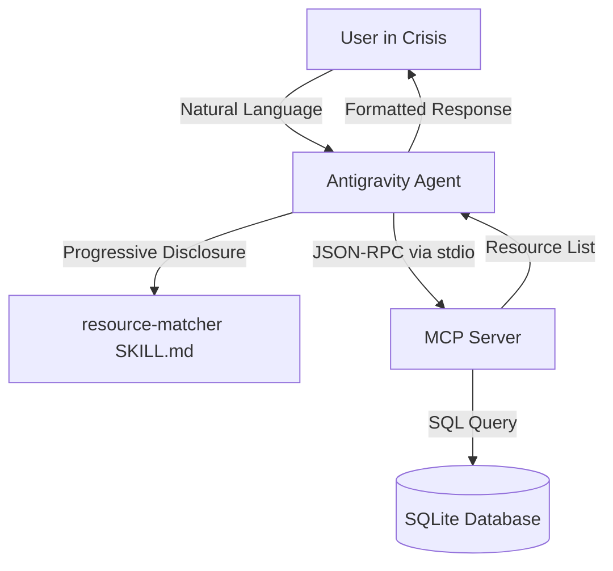

# Emergency Response Coordinator 🆘

An autonomous AI agent designed to match people in crisis with local emergency resources, built for the Kaggle *AI Agents: Intensive Vibe Coding Capstone Project*.

##  Overview (Agents for Good)
During natural disasters or local emergencies, finding real-time, accurate information about available shelters and food banks is critical. The **Emergency Response Coordinator** acts as an autonomous concierge, translating natural language requests into structured database queries to match citizens with verified local resources.

##  Architecture
This project implements the "Factory Model" and Agentic Engineering best practices:

1.  **Antigravity Agent (`agent.py`)**: The central brain (using Gemini 3.1 Pro) that processes intent and orchestrates tool calls.
2.  **MCP Server (`mcp_server.py`)**: An isolated Model Context Protocol (MCP) server that safely exposes the resource database (SQLite) via a standardized `stdio` interface. This enforces Zero Ambient Authority.
3.  **Agent Skills (`SKILL.md`)**: Instead of a bloated system prompt, the agent's procedural memory is stored as an Agent Skill (`resource-matcher`), loading instructions via progressive disclosure only when a user asks for emergency help.



##  Setup Instructions

### Prerequisites
- Python 3.10+
- `google-antigravity` SDK
- `mcp` SDK
- A valid Gemini API Key

### Installation & Run
1. Clone the repository.
2. Install dependencies:
   ```bash
   pip install google-antigravity mcp
   ```
3. Set your API Key:
   ```bash
   export GEMINI_API_KEY="your-api-key-here"
   ```
4. Run the Agent:
   ```bash
   python agent.py
   ```
